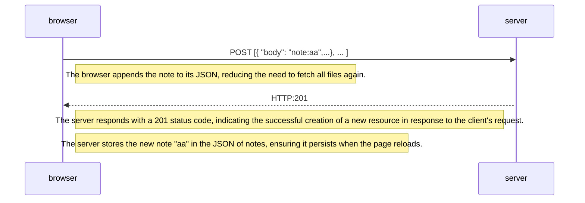

```mermaid
sequenceDiagram
    participant browser
    participant server

    browser->>server: POST [{ "body": "note:aa",...}, ... ]
    Note right of browser: The browser appends the note to its JSON, reducing the need to fetch all files again.
    activate server
    server-->>browser: HTTP:201
    Note right of browser: The server responds with a 201 status code, indicating the successful creation of a new resource in response to the client's request.
    Note right of browser: The server stores the new note "aa" in the JSON of notes, ensuring it persists when the page reloads.

```
