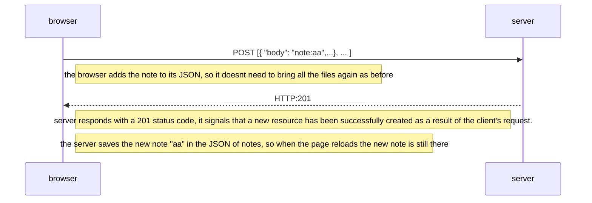

```mermaid
sequenceDiagram
    participant browser
    participant server

    browser->>server: POST [{ "body": "note:aa",...}, ... ]
 Note right of browser: the browser adds the note to its JSON, so it doesnt need to bring all the files again as before
    activate server
    server-->>browser: HTTP:201
 Note right of browser: server responds with a 201 status code, it signals that a new resource has been successfully created as a result of the client's request.
 Note right of browser: the server saves the new note "aa" in the JSON of notes, so when the page reloads the new note is still there
```
