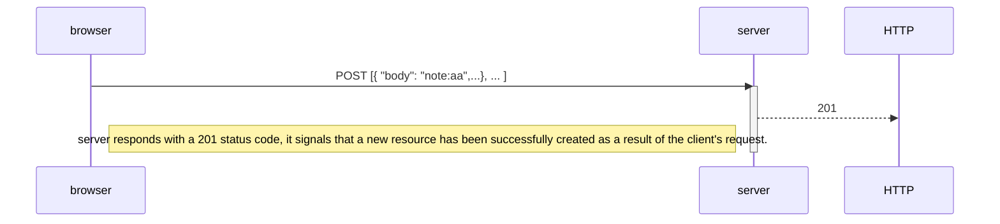

```mermaid
sequenceDiagram
    participant browser
    participant server
    browser->>server: POST [{ "body": "note:aa",...}, ... ]
    activate server
    server-->>HTTP:201
    Note left of server: server responds with a 201 status code, it signals that a new resource has been successfully created as a result of the client's request.
    deactivate server

```
